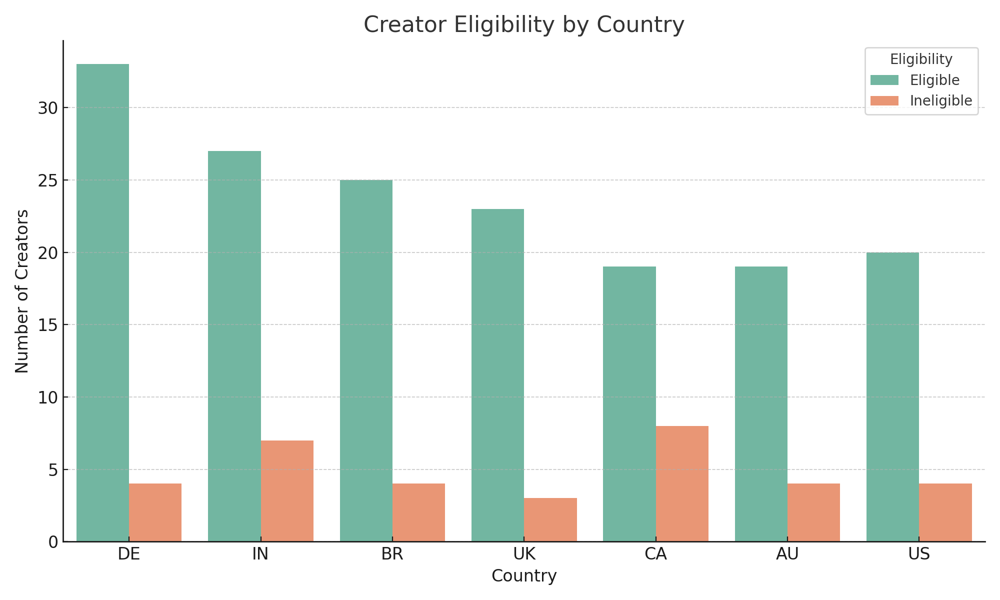

# 🎮 Mock Creator Payout Eligibility Tracker

This project simulates payout eligibility for content creators on a Twitch-like platform. It was inspired by Twitch’s monetization structure and built to explore how changes in payout rules can impact which creators qualify for earnings.

As someone transitioning from financial operations into data science, I designed this project to strengthen my skills in SQL, Python, and causal reasoning — while keeping it relevant to real-world policy and product decisions.

---

## 💡 Project Goals

- Analyze mock creator data and simulate payout eligibility rules.
- Use SQL to filter eligible creators based on specific thresholds (views, country, earnings).
- Use Python (pandas & matplotlib) to clean data, explore trends, and visualize payout patterns.
- Reflect on how changes to eligibility rules affect different types of creators — supporting causal reasoning and impact measurement.

---

## 🧰 Tools Used

- **SQL** (via pandas filtering): query mock data for eligibility logic
- **Python**: data analysis and cleaning with pandas
- **Matplotlib / Seaborn**: visualizing payout distributions
- **Excel** (optional): initial data review and charts

---

## 📁 Dataset

The dataset is synthetic and includes:
- `creator_id`
- `country`
- `monthly_views`
- `monthly_revenue` (in USD)
- `account_age_months`
- `payouts_received`

Eligibility baseline:  
Creators must have **at least 1,000 monthly views** and **$50 in revenue** to qualify for a payout. These thresholds are adjustable for testing.

---

## 📊 Key Questions

- How many creators qualify under current rules?
- How does eligibility change when adjusting thresholds?
- Do certain countries or account ages correlate with payout patterns?
- What trade-offs might a policy team face when revising payout eligibility?

---

## 📸 Sample Visuals

---

## 📝 What I’ve Learned (So Far)

- Practicing SQL helped me understand how to build layered conditions and filter efficiently.
- Using pandas made it easier to slice data and experiment with “what-if” scenarios.
- Visualizing results helped me better communicate the implications of eligibility rule changes — which is key for working across product, legal, and finance teams.

---

## 🔄 Next Steps

- Incorporate more payout timing features to simulate delays or bonuses.
- Build a basic dashboard using Streamlit or Looker Studio.
- Test edge cases for low-income, high-view creators.

---

## 🚀 Why This Matters

Platforms like Twitch constantly refine their payout systems. This project explores how a data scientist might evaluate those changes — not just technically, but strategically. It ties into policy evaluation, monetization equity, and creator satisfaction — which are all part of the bigger picture at Twitch.

---

🌱 Thanks for checking this out!  
You can explore more of my learning journey in the [main portfolio](https://github.com/sbellande).
